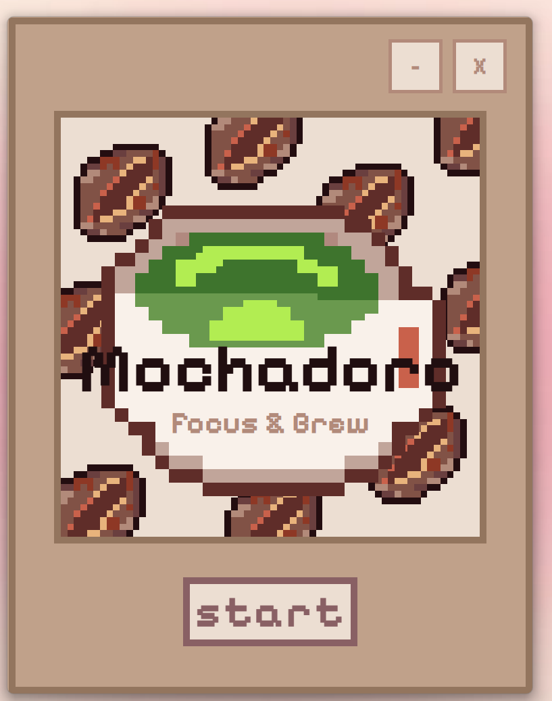
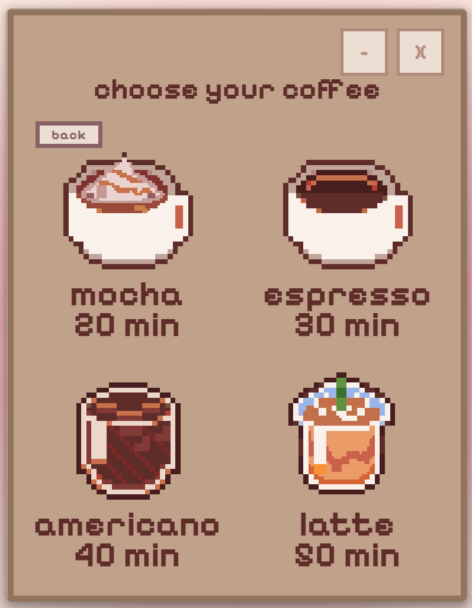
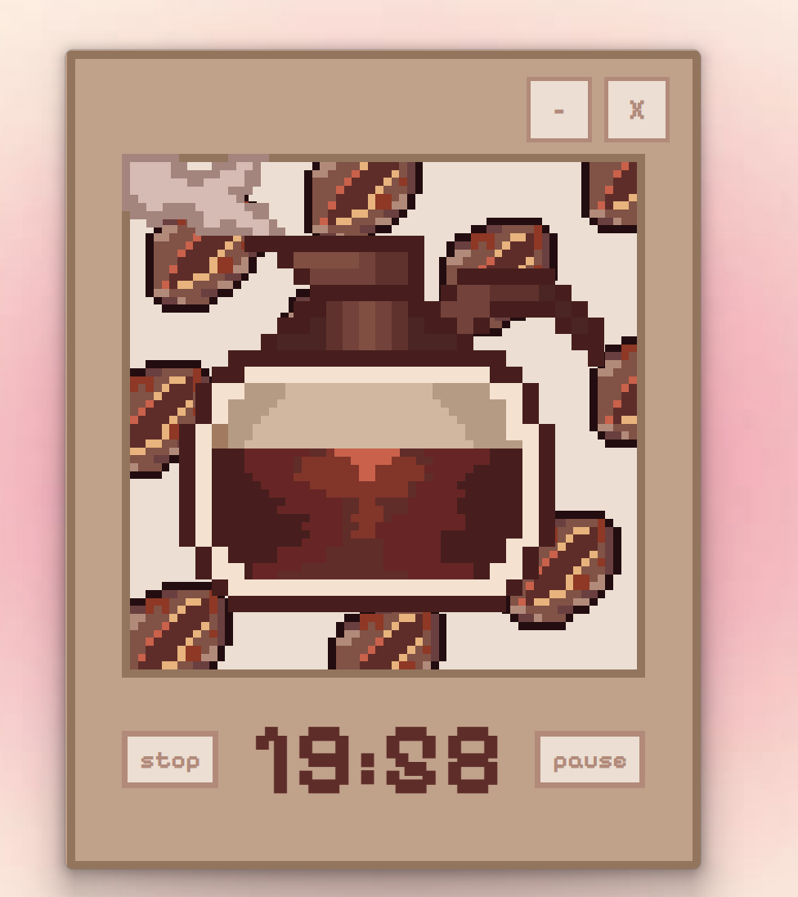
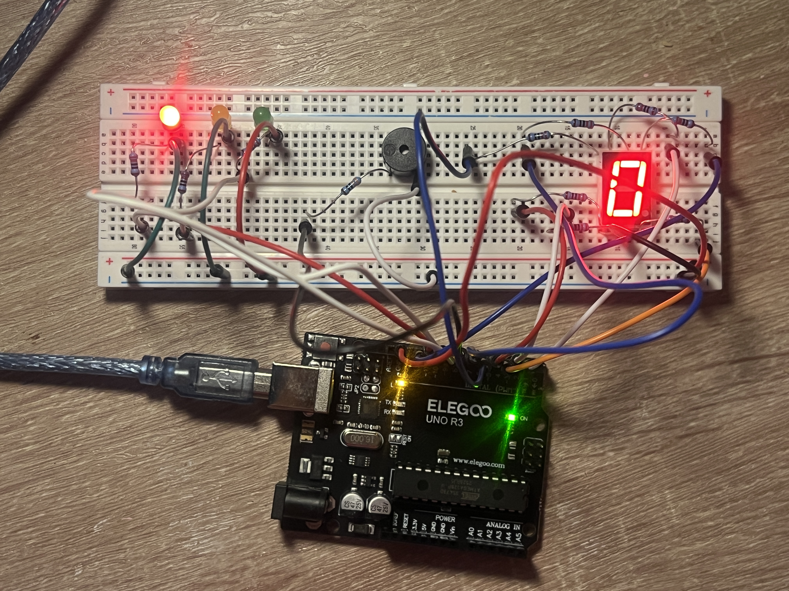
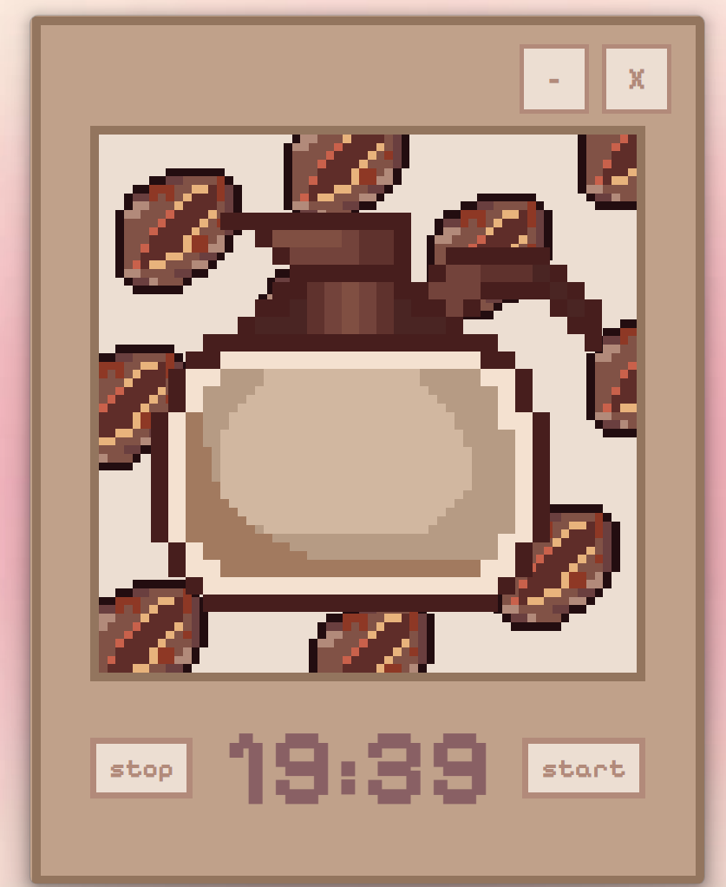
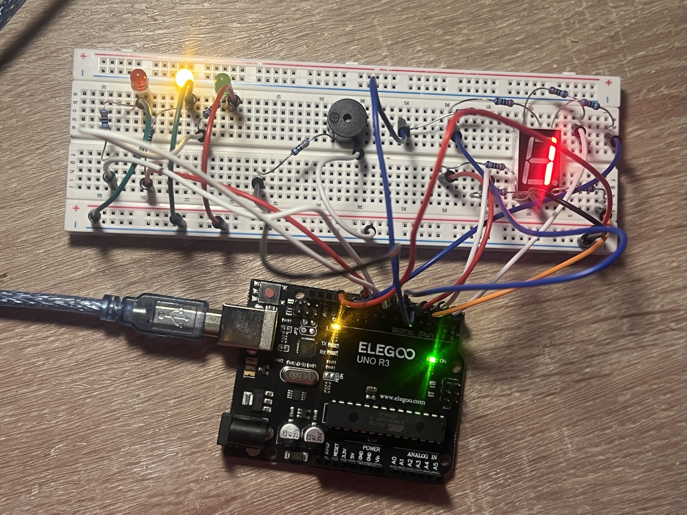
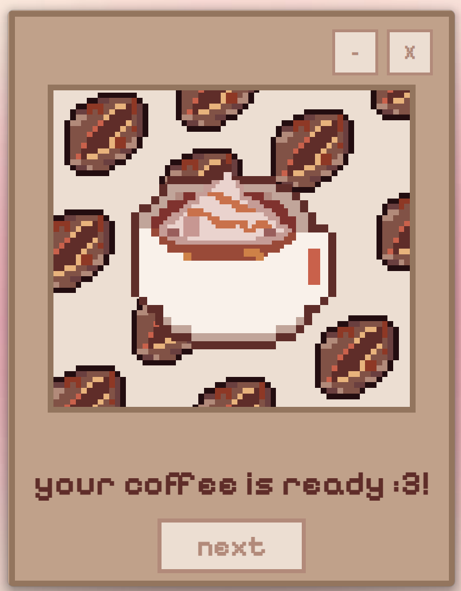
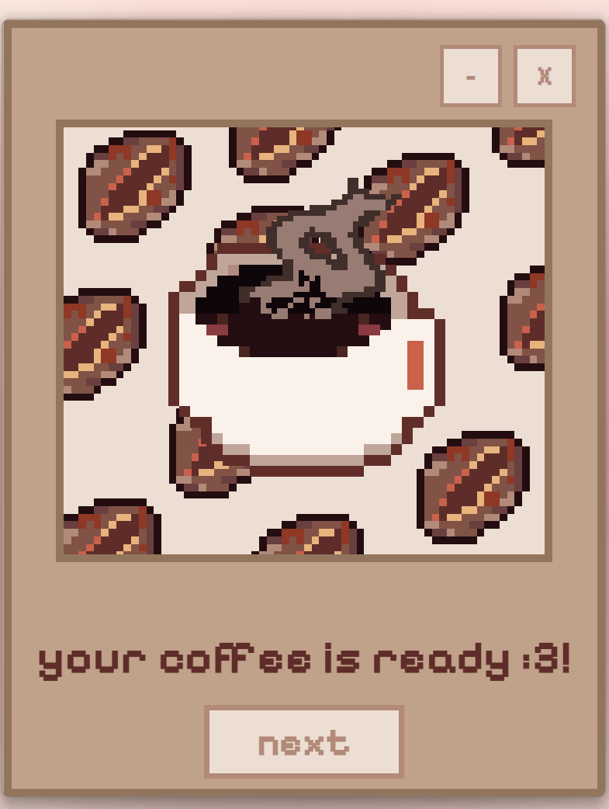
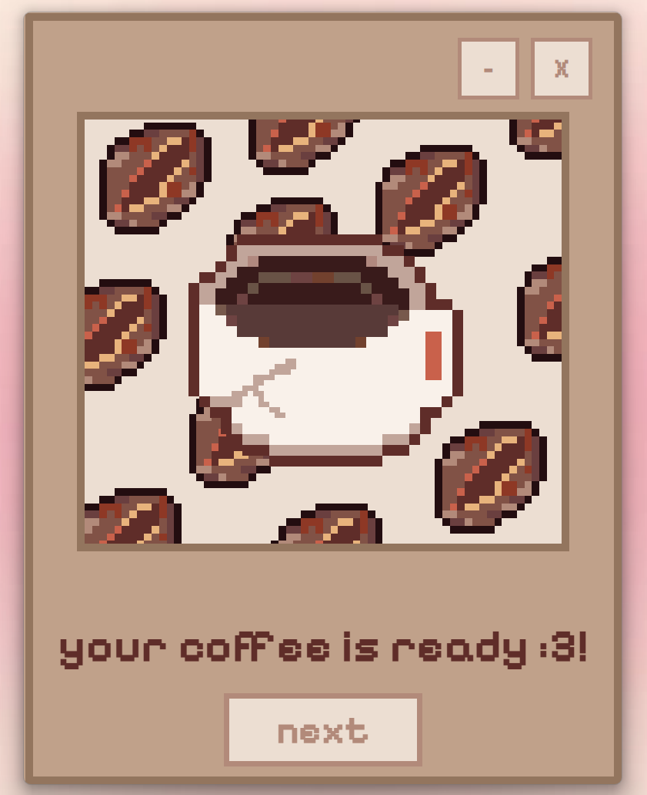
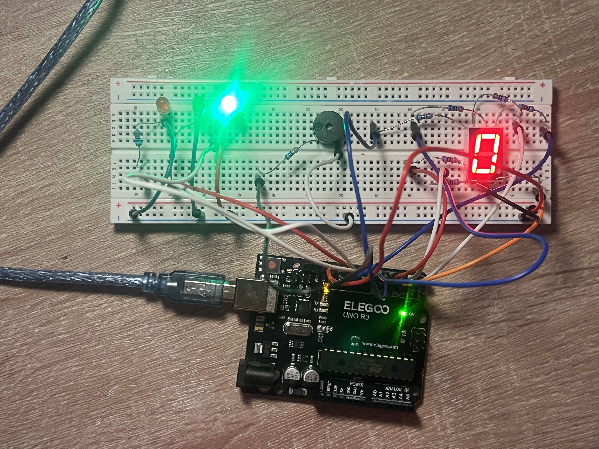

# ☕ Mochadoro
> A cozy, coffee-themed Pomodoro productivity desktop suite paired with an Elegoo Uno R3 physical ambient hardware companion.

## Features
* **Desktop Focus Suite**: Clean Electron/Node.js state machine tracking focus intervals, short/long breaks, and session completion metrics.
* **Hardware-in-the-Loop**: Real-time bi-directional synchronization with an Elegoo Uno R3 over serial communication (`9600 baud`).
* **Triage LED Feedback**: Clear visual state representation via Red (Focus), Amber (Pause), and Green (Break/Complete) indicator LEDs.
* **Single-Digit Readout**: Common-cathode 7-segment display showing active cycle progression.
* **Ergonomic Acoustic Profiles**: Frequency-modulated harmonic arpeggios on a passive piezo buzzer paired with inline decibel attenuation.

## Hardware Pinout Reference

| Component | Pin / Configuration | Notes |
| :--- | :--- | :--- |
| **7-Segment Display (a–g)** | `{7, 12, 4, 5, 3, 2, 6}` | Common cathode (`HIGH` = segment ON) |
| **Red LED (Focus)** | Pin 10 | Triage active focus state |
| **Amber LED (Pause)** | Pin 11 | Triage pause / standby state |
| **Green LED (Break / Done)** | Pin 9 | Triage break / completion state |
| **Passive Piezo Buzzer** | Pin 8 | Inline **330Ω resistor** required for decibel attenuation |

## Serial Command Protocol (`9600 baud`)

| Command | Behavior & Hardware Response |
| :--- | :--- |
| `FOCUS_START` | Sets Red LED HIGH, clears others, triggers ascending triad chime (`C5 → E5 → G5`) |
| `PAUSE` | Sets Amber LED HIGH, clears others, triggers soft 400Hz haptic tap (`50 ms`) |
| `BREAK_START` / `SESSION_DONE` | Sets Green LED HIGH, clears others, triggers descending settle chime (`G5 → E5 → C5`) |
| `DISP:X` | Renders integer digit `0–9` onto the 7-segment display |
| `LED:R:1` / `0` | Direct manual override for Red LED |
| `LED:A:1` / `0` | Direct manual override for Amber LED |
| `LED:G:1` / `0` | Direct manual override for Green LED |
| `BUZZ:ON` / `BUZZ:OFF` | Manual tone trigger fallback / safety kill-switch |

## Acoustic Contour Specifications
* **The Pour (Focus Start)**: Ascending major triad (`523 Hz` for 60ms → `20 ms` gap → `659 Hz` for 60ms → `20 ms` gap → `784 Hz` for 140ms).
* **The Sip (Break / Completion)**: Soft descending settle (`784 Hz` for 70ms → `20 ms` gap → `659 Hz` for 70ms → `20 ms` gap → `523 Hz` for 220ms).

## Visual Walkthrough
* **Menu & Setup**
  * Start Menu: 
  * Coffee Selection: 
  * Dynamic Duration Scaling: 
* **Focus State**
  * Red LED & Active Focus: 
* **Paused State**
  * UI Pause: 
  * Hardware Pause: 
* **Session Outcomes**
  * Completed Mocha: 
  * Burned Coffee (Early Stop): 
  * Still Coffee (3x Pause Limit): 
* **Break Interval**
  * Green LED Break: 

## Setup & Quickstart Guide
1. **Flash Firmware**: Open your Arduino IDE, load the embedded sketch, and upload it to your Elegoo Uno R3.
2. **Circuit Assembly**: Wire the common-cathode 7-segment display, RGB indicator LEDs, and passive piezo buzzer (routed through the 330Ω signal resistor to Pin 8 and GND).
3. **Desktop Dependencies**: Open your project root in terminal and run your package manager install command to populate Electron and serial dependencies.
4. **Launch Application**: Start the desktop environment and verify your USB serial port mapping (`COM3` at `9600 baud`).

## Tech Stack
* **Desktop**: Electron, Node.js, JavaScript, HTML, CSS
* **Embedded / Hardware**: C++, Arduino, UART/Serial (`9600 baud`), GPIO, PWM/Tone frequency modulation
